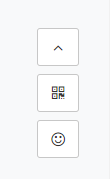

# JS-plugins
Javascript plugins

## gotop.js [README.md](gotop/README.md)
原生js实现, 一个固定在网页下方, 点击返回顶部的按钮

## page.js [README.md](page/README.md)
动态生成bootstrap分页, 用"..."隐藏过多的页

## imglazy.js [README.md](imglazy/README.md)
图片懒加载

## share.js [README.md](share/README.md)
原生实现分享页面到微博, QQ, 人人...

## parse-csv.js
解析.csv文件

## bar.js
自定义生成底部按钮栏, 可选按钮类型`回到顶部`, `显示图片按钮`, `转发到微博`

